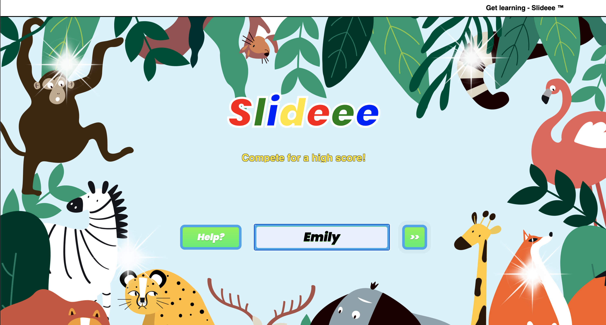

# AnimalQuiz

### About
AnimalQuiz is an educational app aimed at children in primary school. It allows users to compete with others, by answering 10 questions, based on numerical facts on animals. Points are awarded on accuracy and time elapsed. Questions are randomly generated from a custom built API.

### Setup
##### Client

    cd client
    npm install
    npm run serve

This should open a browser window, if not go to http://localhost:3000

##### Server
    cd server
    npm install
    npm run seeds
    npm server:dev

Once both the server & client are runnning go to http://localhost:3000 to start the app

### Walkthrough

#### Homepage
The user can input their name and click the double arrow to start the quiz. Clicking the Help button will drop down instructions

#### Question Page
The user will be shown a question with a background picture of the selected animal. Using the slider input the user can guess the correct value. On submit the user will score points on accuracy and speed and given answer feedback.

#### End Page
Once the user has completed 10 questions their score will be added to the database and the top 3 scores will displayed to them.

#### Authors
Craig Laws, Donald Cameron & Sam Cassie
